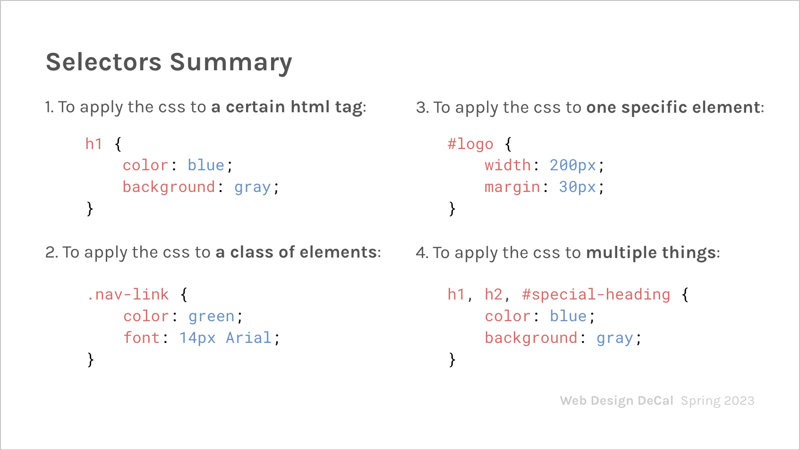
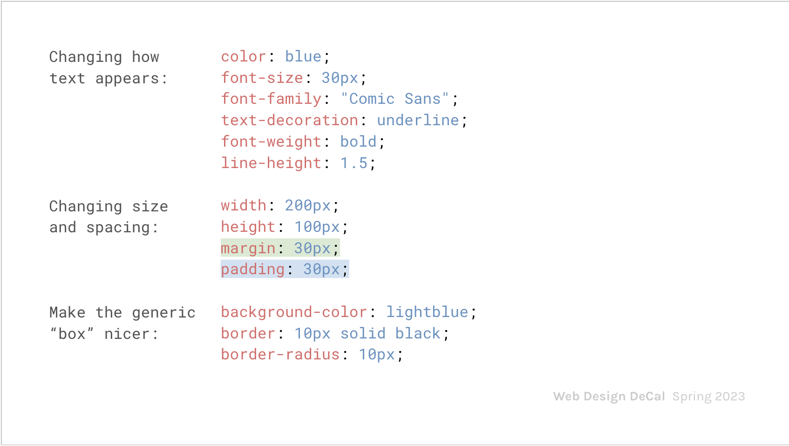

# CSS Selectors, Pseudo-selectors
Thur Sept 14
Second Lecture [Slides Here](https://docs.google.com/presentation/d/1uZhnn_JkKoJU-lpSY46tW0seQGcjQTPTcXfoY7MF6QE/edit#slide=id.g604587fed6_1_0_
)

<span style ='color :red;'> HW2 Due Thur 9/21 6:30pm </span>

* prefer **relative paths** to absolute paths ``` assets/img/img.png ```
  
## Agenda:
* CSS
  * [Files and linking CSS](#linking-css-in-html)
  * [CSS syntax](#css-syntax)
  * [CSS selectors](#css-selectors)
  * Pseudo-selectors
* Design


## TOC

___________
<p align ="center"></p>

___________
  
## CSS
### Linking CSS in HTML
HTML knows where to find the css by linking 
* The samw way we name html files "index.html", we'l usually name our css file "sytle.css" and put it in the assets folder

inside the ```<head> ```tag, add this:
```
<link rel ="stylesheet" type = "text/css" href="asset/styles/style.css">

```
### CSS Syntax
<p align ="center" >

</p>

* background changes **bckgnd color**
* color changes **font color**
```h1 {``` selects the element

### Selectors
Selectors tells us what elements in the HTML to "select", or apply the specified properties to
ex:
Selecting all div elements
~~~
div{
    font-size: 32px;
    color; green
} 
~~~

### Property and Value 
**<span style = "color:blue;">Property</span>**
Defines **what** we are changing about the selected element

**<span style = "color:blue;">Value</span>**
Specifies **how** we are changing it, or what it should be gathed in 

**Together**: Declaration (or rule)
 
### Miscellanous, Very Small things
* rules (preoperty and attribute pairs) for a selctor fall between **curly braces**
* rules with curley braces are separated by **semicolons**
* comments surrounded by ```/*``` and ```*/```

Ex.
~~~
div{
    font-size: 32px;
    color: green;
}

img{
    /* This is a comment*/
    width: 50%;
}
~~~

#### HTML and CSS at a Glance 
View example [here](https://jsbin.com/gebomifozo/edit?html,css,output)
<p align ="center" >


</p>

## CSS Selectors
### Classes 
Apply a set of rules to **<span style="color:blue;"> multiple elements </span>** on the page

HTML: add the **class attribute to the opening tag**
CSS: put a **period in front of the class name** as a selector
<p align ="center" ></p>

### IDs
Apply a set of rules only to **<span style="color:red;"> one distinct element </span>**
HTML: add **id** attribute to opening tag
CSS: put a **hashtag in front of the id name** as a selector
<p align = "center"></p>
note:
When you have conflicting rules for an element / tag that’s defined for the tag, the class, and the ID, the ID rule takes priority over the class rule, which takes priority over the tag rule. This is called specificity. The **more specific the selector, the more power it has to override other rules** than less specific selectors.


### Selecting Multiple Elements
* Separate each element with a **comma** 
* CSS **properties and values will be applied to all selected elements**
<p align="center"></p>

#### Selecting Elements w/ Mulitple Names
* Classes can have multiple names within one tag.
* No space between CSS selectors.
* **“Select all elements with both .green and .big set within its class.”**
* CSS in the example will only **<span style="color:blue;">apply to the first</span>** ```<p>``` tag, but **<span style="color:red;">not the second </span>.**
  <p align="center"></p> 

#### Selecting Nested Elements
* Space between selectors
* **"Select all elements with ```park``` that are nested with in ```#jay```**
* CSS in the example will only apply to the first ```<p>```, but not the second
<p align="center"></p> 

### Pseudo-Selectors
Pseudo-selects selects elements that are under a certain **state**, great for **user interaction**
The general pseudo-selector structure: **<span style="background-color:lightblue;"> normal-selector:pseudo-class</span>**

In the example, rules will be applied to the div **only when the cursor is hovering over**
<p align="center"></p>

Some other examples:
```:hover``` when mouse hovers over an element
```:visted``` when a link has been visited before (default is purple hyperlink)
```:active``` when the mouse is currently clicked on an element
[... and many many more](https://www.w3schools.com/css/css_pseudo_classes.asp")

### Summary
<p align="center">



</p>

## Introduction to Design
Approach design as problem solving
1. surface - visual design
2. Skeleton - interface and navigation design, information design
3. strucutre - 
4. Scope
5. Strategy

UX, UX, and HCD
Fidelity (low and high fidelity)

wireframe --> mockup --> 


## Visual Heirarchy and Spacing
### Importance of space
* Quality > Quantity

Positive Space
* filled with content
* pictures/words

White space/negative space
* empty space

Barren: overuse of whitespace

### Macro & Micro Level Spacing
Macro-level spacing: space between core elements

**Padding and Margin**
Padding: Spacing withing the broder of an element
Margin: 

**CSS Box Model**
For spacing in webdesign


